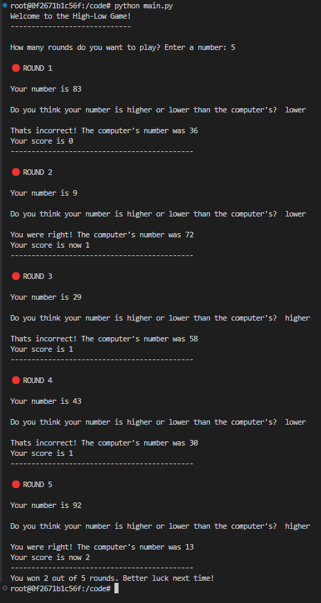

# High-Low Game

## Overview

This is a Python implementation of the High-Low game. The game involves guessing whether your randomly generated number is higher or lower than the computer's number. If your guess is correct, you score a point. The number of rounds is determined by the user at the start of the game, and your final score is calculated based on your performance across those rounds.

## How to Play

1. **Start the Game**: The game will prompt you to enter the number of rounds you'd like to play. Then, in each round, two random numbers between 1 and 100 are generated: one for you and one for the computer.

2. **Make a Guess**: You will be prompted to guess whether your number is higher or lower than the computer's number.

3. **Scoring**: If your guess is correct, you score a point. After each round, your current score is displayed.

4. **End of the Game**: At the end of all rounds, your total score will be displayed, along with a message evaluating your performance.

## Sample Output



## Installation and Running the Game

1. **Clone the Repository**:

   ```bash
   git clone <repository_url>
   cd high-low-game

   ```

2. Run the Game

   ```bash
   python high_low_game.py
   ```
